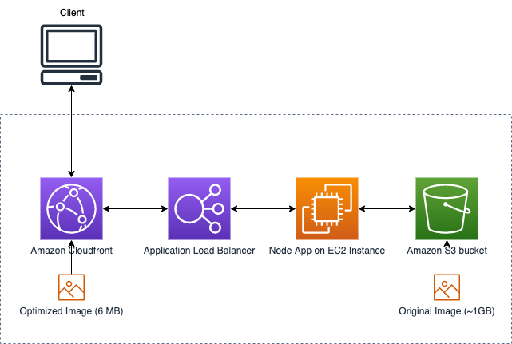

# Dyamic Image Handler PoC

## About

This is a PoC created to support dynamic image rendition with an image resize support. Additional features can be added as required in the future. This is developed based on the Sharp opensource framework. This application can be used as a standalone NodeJS app running in EC2. 
## Architecture



## Input / Output

Request:
Access the DIH with below URI path:

http://{{host}}:{{port}}/image/:bucket/:edits/:key

> - port - Using port 80 in this PoC, this can be changed in .env file
> - bucket - Source S3 bucket where the image is stored
> - edits - {{width}}x{{height}} - Expected resize image size
> - key - Image name with extension

Sample request:
http://localhost/image/source-bucket/800x800/sample1.jpg

Sample response:
Modified image response


## Install Prerequisites

- Git
- Node JS v14 or above
- npm v6 or above
- Typescript
- Create an IAM Role with access to the source and destination S3 buckets. Attach that role to the user used to access S3 from local

## App Build

### Local setup

Clone the source code to your local folder

```
git clone git@github.com:aws-samples/dynamic-image-handler-poc.git
```

Make sure you are in the source root directory - `dynamic-image-handler-poc`

```
cd dynamic-image-handler-poc
```

##### Install the dependencies

```
npm install
```

##### Setup ESLint (Follow the prompt to install ESLint using TypeScript with JSON configuration)

```
npm init @eslint/config
```

##### Local build

```
npm run build
```

##### Local run

```
npm run start
```

#### Verification

Access the application following the instructions provided in `Input/Output` section above thru Postman

### Server setup

CDK deployment - This will install VPC, Subnets, NAT Gateway, ALB, ASG, EC2 launch configuration. 

NOTE: This deploymet doesn't add HTTPS certificates to ALB and CloudFront. Please modify the script to add HTTPS support & CloudFront deployment. If deplpoying into GovCloud, you can utilize commercial CloudFront with GovCloud Origin as described here - https://docs.aws.amazon.com/govcloud-us/latest/UserGuide/setting-up-cloudfront.html

##### AWS CDK v2 Setup

Please complete CDK setup and authentication as per https://docs.aws.amazon.com/cdk/v2/guide/getting_started.html

#####  Install latest cdk version

```
npm install -g aws-cdk
npm install -g aws-cdk-lib
```

#####  Installation

Clone the source code to your local folder

```
git clone git@github.com:aws-samples/dynamic-image-handler-poc.git
```

Make sure you are in the source root directory - `dynamic-image-handler-poc`

```
cd dynamic-image-handler-poc
```

Goto `constructs` directory to access CDK scripts 

```
cd constructs
```

#####  Install, test and build

```
npm install
npm run test
npm run build
```


##### Execute below CDK commands to deploy the infrastructure and the application. 

```
cdk bootstrap

cdk synth

```

##### Once you verify the synth output, deploy the stack using

```
cdk deploy
```

NOTE: This should deploy all the required infra components and the application. Use ALB DNS URL to verify the application. Use postman to process the image. Make sure, you pass the appropriate S3 bucket and image to succesfully process the images.

#### Verification

Access the application load balancer URL provided in CloudFormation Output console. Please follow the instructions provided in `Input/Output` section above to access the application thru Postman

#### Cleanup 

!!!Note Make sure to remove all the policies from the role before running destroy

```
//List the role
aws iam list-roles | jq -r '.Roles[] | select(.RoleName|match("DIH-CDK-Stack-EC2IAMRole."))'

// Copy the full rolename (role-name)
// "RoleName" :

//List attached policy
aws iam list-attached-role-policies --role-name $role-name

// Copy Policy ARN (policy-arn)
//"AttachedPolicies"

//Detach the policies attached to the role
aws iam detach-role-policy --role-name $role-name --policy-arn $policy-arn

```

###### Stack cleanup   

```
cdk destroy
```


