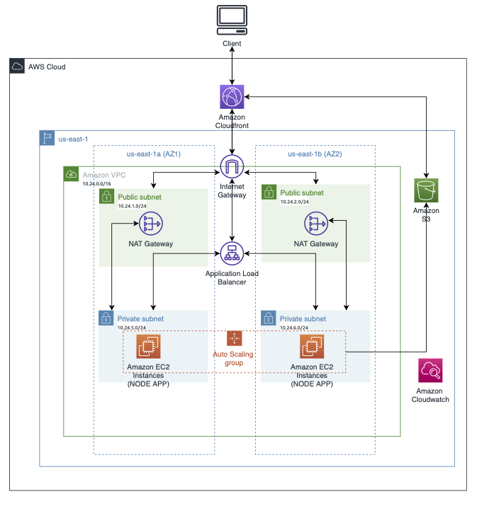
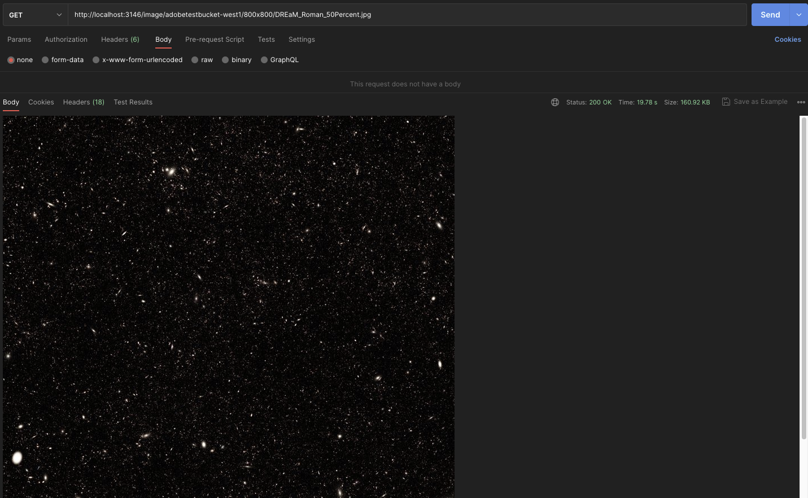

# Dyamic Image Handler PoC

## About

This is a PoC created to support dynamic image rendition with an image resize support. Additional features can be added as required in the future. This is developed based on the Sharp opensource framework. This application can be used as a standalone NodeJS app running in EC2 or containerize it.

## Architecture



## Input / Output

Request:
Access the DIH with below URI path:

http://{{host}}:{{port}}/image/:bucket/:edits/:key

> bucket - Source S3 bucket where the image is stored
> edits - {{width}}x{{height}} - Expected resize image size
> key - Image name with extension

Sample request:
http://localhost:3146/image/source-bucket/800x800/sample1.jpg

Response:
Modified image response



## Install Prerequisites

- Git
- Node JS v14 or above
- npm v6 or above
- Create an IAM Role with access to the source and destination S3 buckets. Attach that role to the user used to access S3 from local

## App Build

### Local setup

Clone the source code  
 From the source root directory, run the below commands

Install the dependencies

```
npm install
```

Setup ESLint

```
npm init @eslint/config
```

Local build

```
npm run build
```

Local run

```
npm run start
```

### Server setup

As described in the architecture above, setup the services listed below to get the PoC app up & running.

1. Deploy this PoC application in an EC2 instance as described in the `Local setup`

2. Use PM2 to run the Node App daemon in EC2 instance and verify the app

```
npm run pm2

pm2 list
```

Verify the endpoint: http://{hostname}:3146/

3. Create an AMI of the EC2 instance - `POCAMI`
4. Create a VPC
5. Create private subnets across 2 AZs
6. Create Security groups
7. Create a role with access to S3, EC2 and use it when you launch the EC2 instance
8. Create launch template using the AMI (POCAMI) you created in step 3.
9. Create auto scaling group using the launch template just created, add ALB with the target groups mapped.
10. Create Cloudfront distribution with Origin set to the ALB created in step 9.

### To Do

Cloudformation template to create the above stack
